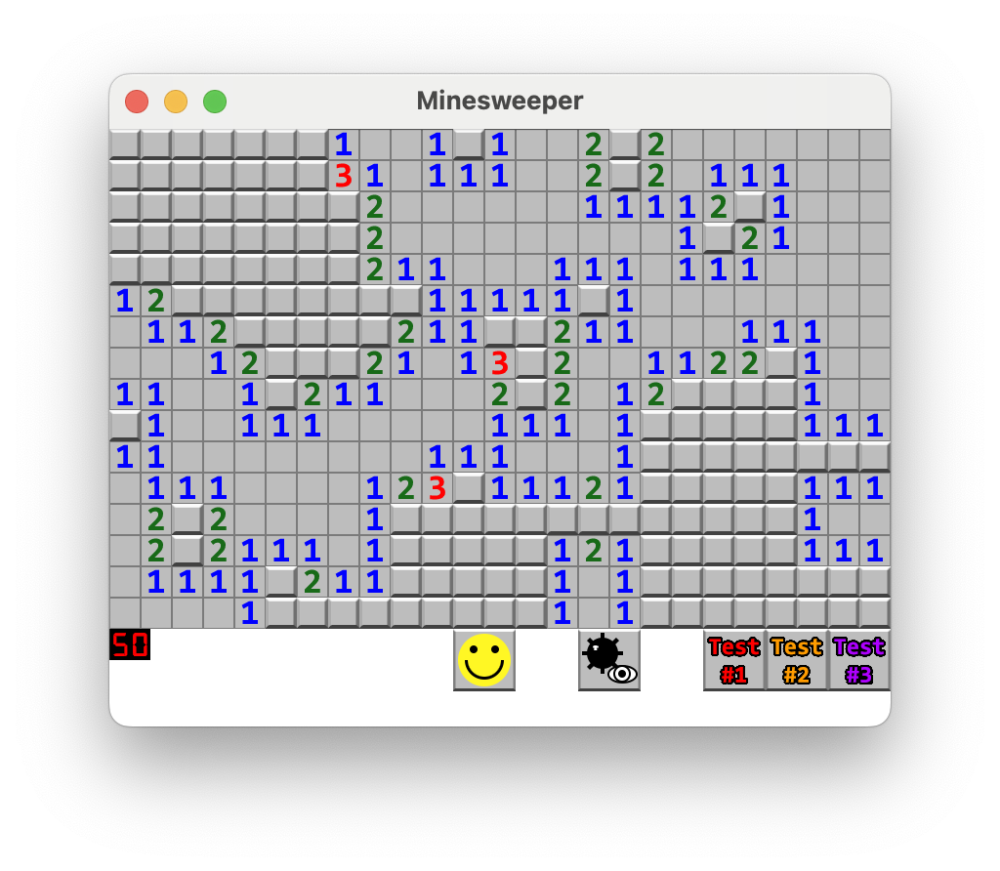

# Minesweeper

A classic Minesweeper game built with C++, SFML, and CMake. The objective of the game is to uncover all the squares on the grid without triggering any hidden mines. The game features a simple, user-friendly interface and is playable on most platforms.



## How to Use

1. Install [Git](https://git-scm.com/downloads) and [CMake](https://cmake.org/download/). Use your system's package manager if available.
2. Clone GitHub repo and open the repo in your text editor of choice.
3. If you use Linux, install SFML's dependencies using your system package manager. On Ubuntu and other Debian-based distributions you can use the following commands:
   ```
   sudo apt update
   sudo apt install \
       libxrandr-dev \
       libxcursor-dev \
       libxi-dev \
       libudev-dev \
       libfreetype-dev \
       libflac-dev \
       libvorbis-dev \
       libgl1-mesa-dev \
       libegl1-mesa-dev \
       libfreetype-dev
   ```
4. Build project. Most popular IDEs support CMake projects with very little effort on your part.

   - [VS Code](https://code.visualstudio.com) via the [CMake extension](https://code.visualstudio.com/docs/cpp/cmake-linux)
   - [Visual Studio](https://docs.microsoft.com/en-us/cpp/build/cmake-projects-in-visual-studio?view=msvc-170)
   - [CLion](https://www.jetbrains.com/clion/features/cmake-support.html)
   - [Qt Creator](https://doc.qt.io/qtcreator/creator-project-cmake.html)

   Using CMake from the command line is straightforward as well.
   Be sure to run these commands in the root directory of the project you just created.

   ```
   cmake -B build
   cmake --build build
   ```
5. Run Minesweeper executable.
    ```
    ./minesweeper
    ```
6. Enjoy!